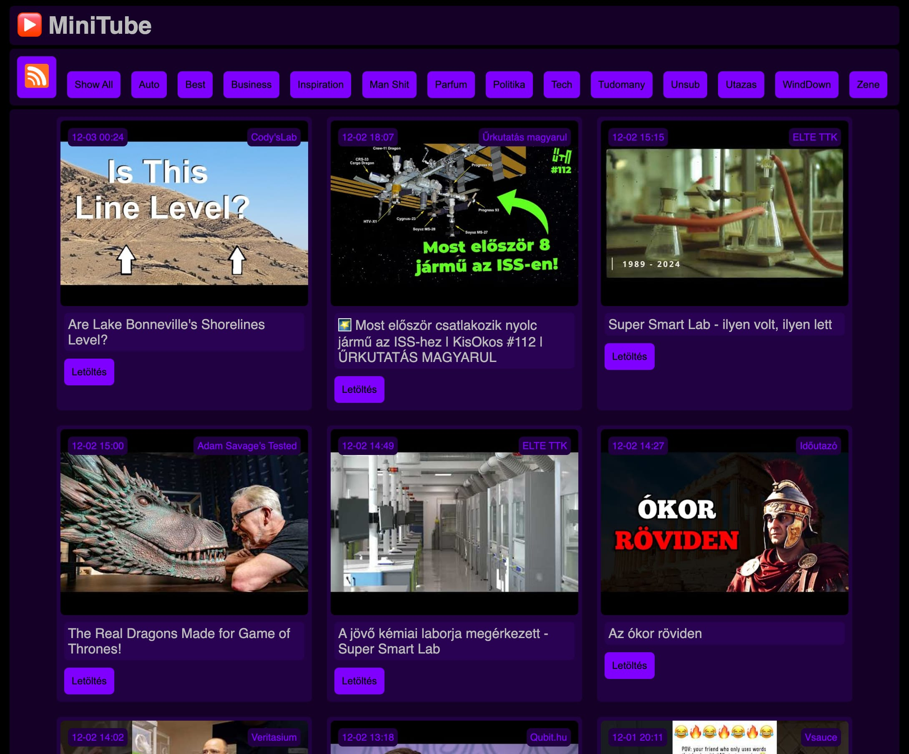

MiniTube YouTube Frontend and Downloader
================

A simple PHP-based frontend for browsing YouTube videos from your subscribed, categorized channels. It allows you to download videos as MP3 files. Generates an RSS feed from these mp3s for podcast apps - for example Apple Podcasts.

Compatible with PocketTube Chrome extension for managing YouTube subscriptions and categories.



Setup
-----

0. You need a LAMP server, and these packages installed:
   - FFmpeg
   - python 3.10+
   - (yt-dlp automamtically downloaded by the script)
1. Clone or copy this repository to your server.
2. Read and adjust the configuration in `config.php`.
3. Set up a cron job (`sudo crontab -e`) to run `update.php` periodically (e.g. every hour) to fetch new videos.

```bash
0 * * * * /usr/bin/php /var/www/path_to_minitube/update.php
```

How to manage Subscriptions?
----------------------------

The main file that contains subscriptions is `channels.json`. Format:

```json
{
  "category1": [
    "channelNameOrId1", 
    "channelNameOrId2"
  ],
  "category2": [
    "channelNameOrId3", 
    "channelNameOrId4"
    ]
}
```

You can edit this manually (paste YouTube channel username or ID), or use the [PocketTube Chrome extension](https://chromewebstore.google.com/detail/pockettube-youtube-subscr/kdmnjgijlmjgmimahnillepgcgeemffb) to manage categories directly on youtube and then export your subscriptions list as json file.

How to use it in Apple Podcasts?
--------------------------------

1. Open Apple Podcasts.
2. Go to "File" -> "Add a Show by URL..."
3. Enter the URL `https://yourdomain.com/minitube/rssfeed.php`

Whenever you click the download button for a video in MiniTube, the MP3 will be available in your podcast app as well in a couple of minutes.

